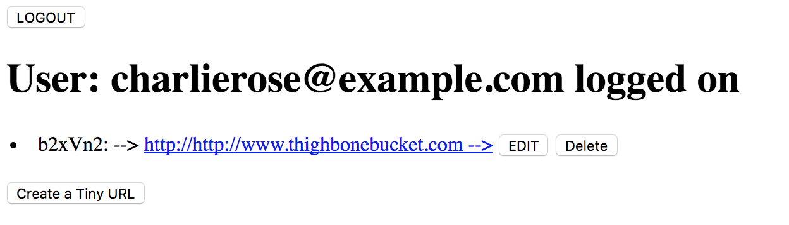

# TinyApp Project

TinyApp is a full stack web application built with Node and Express that allows users to shorten long URLs (à la bit.ly).

## Final Product

TinyApp allows users to login and create and update shortened url redirects to whatever URL they would like.

TinyApp allows a user to create, update and/or delete shortened url redirects that were created by the user while in session

TinyApp allows for user registration ( no deregistration functionality )

TinyApp is a demo project for the Lighthouse Labs (LHL) Web Development Bootcamp.
There is no persistent database and no actual data is stored after a session has closed.

If you wish to use TinyApp it is suggested you login as

email : charlierose@example.com
password : conversation

### Here's the login screen

The user is then brought to the list of URLs under their management

For each URL the redirect can be updated to point to a different URL or Deleted altogether

### Update

### Delete

### Create

### Registration is simple and fun

## Dependencies

- Node.js
- Express
- EJS
- bcrypt
- body-parser
- cookie-session

## Getting Started

- Install all dependencies (using the `npm install` command).
- Run the development web server using the `node express_server.js` command.

